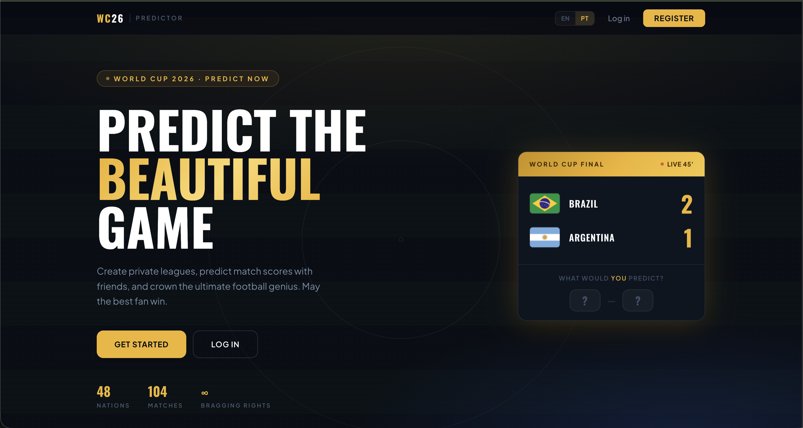

# World Cup Predictor

A private prediction league app for the FIFA World Cup 2026. Friends create leagues, predict scores for every match, and compete on a live leaderboard that updates automatically as results come in.

**Live demo:** [wcfootballpredictions.com](https://wcfootballpredictions.com)

---



---

## Features

- **Private leagues** — create a league and share an invite code with your group
- **Score predictions** — predict the exact scoreline for every World Cup match before kickoff
- **Live leaderboard** — points update automatically when results come in, no manual input needed
- **Customizable scoring** — each league creator sets their own point values per category (exact score, correct winner, goal difference, one correct team)
- **Prediction comparison** — see what your league mates predicted vs. what you predicted, for any match
- **Match calendar** — browse all fixtures in month or week view, filter by team, colour-coded by tournament stage
- **Tournament statistics** — live stats page: goals scored, goals per game, top attack/defence rankings, score distribution, and fun facts
- **Calendar export** — download an `.ics` file or send it to your email to add World Cup matches to your personal calendar
- **Internationalization** — UI available in English and Portuguese
- **Admin panel** — sync fixtures, apply results manually, and recompute scores for any league

---

## Tech stack

| Layer | Technology |
|---|---|
| Frontend | Next.js (App Router), TypeScript, Tailwind CSS v4 |
| Backend | FastAPI, Python 3.11+, SQLAlchemy 2.x |
| Database | PostgreSQL 16 |
| Auth | JWT (python-jose), bcrypt passwords |
| Live data | football-data.org v4 API + APScheduler |
| Deployment | GCP Cloud Run (frontend + backend), Compute Engine VM (Postgres) |
| Local dev | Docker Compose |

---

## Quick start

Requires [Docker](https://docs.docker.com/get-docker/) and [Docker Compose](https://docs.docker.com/compose/).

```bash
# 1. Clone the repo
git clone <repo-url>
cd world_cup_predictor_app

# 2. Configure the backend
cp backend/.env.example backend/.env
# Edit backend/.env — set FOOTBALL_API_KEY (free at football-data.org)

# 3. Start everything
docker compose up --build

# 4. Run database migrations (first run only)
docker compose exec api alembic upgrade head

# 5. Open the app
# Frontend:  http://localhost:3000
# API docs:  http://localhost:8080/docs
```

For local dev without Docker, see [docs/architecture.md](docs/architecture.md#running-locally-dev).

---

## Documentation

| Guide | Description |
|---|---|
| [Architecture](docs/architecture.md) | Tech stack, project structure, backend layers, DB schema, API reference |
| [Scoring system](docs/scoring.md) | How points are calculated — categories, stacking rules, worked examples |
| [Deployment](docs/deployment.md) | Full GCP deployment runbook (Cloud Run + Compute Engine Postgres VM) |
| [Post-deploy](docs/post-deploy.md) | Invite codes, admin setup, sharing the app with players |
| [Custom domain](docs/custom-domain.md) | Pointing a custom domain at the Cloud Run frontend |

---

## How it works

1. A user creates a league and shares an invite code with friends
2. Friends register using the invite code and join the league
3. Everyone submits score predictions for each match — before kickoff
4. When a match finishes, the app fetches the result from football-data.org and scores all predictions automatically
5. The leaderboard updates in real time

Predictions lock the moment a match goes live. The background scheduler handles everything — no admin action needed for normal operation.

See [docs/scoring.md](docs/scoring.md) for full details on how points are calculated.
